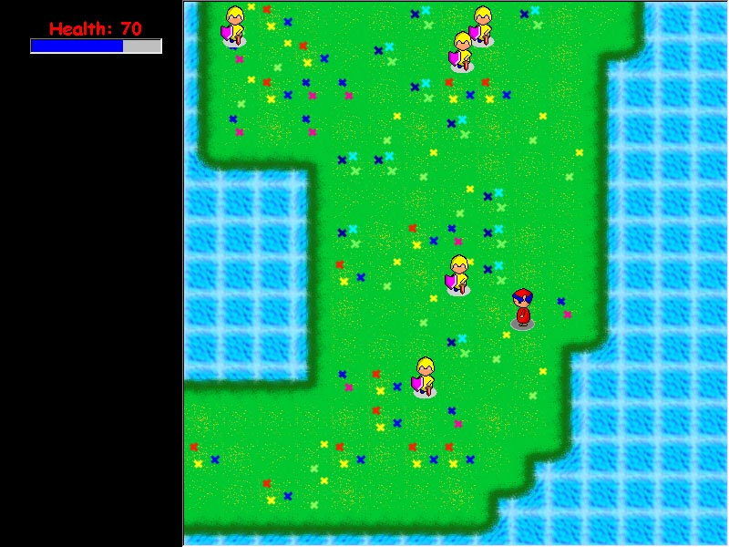



## A REALLY COOL GAME ENGINE \- see screenshot

### Description

It is a game "engine" basically. I was making this game a long time ago called Damiens Quest, over a half a year but gave up into making it a full game. It comes with a map editor specially made for this game and the game itself. You can walk around and get hit, but thats about all. At the time when I stopped, I implementing magical powers and music into the game, but stopped. Study the code and alter it any way you like to fit your needs. All the graphics (tiles and sprites) were created by me, and most of the coding except for the resolution change was coded by me also.

Here is a few things to take note of:

The game sets the resolution to 800x600x32 when you run it, so don't be scared if your screen flickers for a second. Make sure you stop the game the proper way to get it set back.

I didn't implement the code to change resolutions on the map editor, I got to lazy, so to make it look normal set your resolution at 800x600x32. If you resolution is different then you wont see all the tiles or the lines keep on drawing even after the tiles stop.

To exit the game the way it was meant to, double click on the black background to the left side of the game screen. This will set your resolution back to normal so don't worry. If you do ctrl + break then the resolution doesn't get set back. I warned you.

Don't play the game with the music checkbox on, for some reason the enemies run super fast. I was going to fix this but I stopped working on it.

I know this game is very basic, but it is to teach you what can be done. To be honest, I forgot what a lot of my variables mean so I can't be much help anymore. I just wanted to share this with you, but if you do need some help then ask for it in the reply, I'll do my best to help you.

my email is hdem2@socal.rr.com send me comments or questions here.

If most of you don't understand how the game actually works, I will write up a quick tutorial that explains how everything works. (hopefully I remember after all this time) So in your replies ask for this tutorial, and email me so I will forsure see it.
 
### More Info
 

             |
---                |---
**Submitted On**   |2001-02-18 15:16:48
**By**             |[Haig Demerdjian](https://github.com/Planet-Source-Code/PSCIndex/blob/master/ByAuthor/haig-demerdjian.md)
**Level**          |Advanced
**User Rating**    |4.4 (53 globes from 12 users)
**Compatibility**  |VB 5\.0, VB 6\.0
**Category**       |[Games](https://github.com/Planet-Source-Code/PSCIndex/blob/master/ByCategory/games__1-38.md)
**World**          |[Visual Basic](https://github.com/Planet-Source-Code/PSCIndex/blob/master/ByWorld/visual-basic.md)
**Archive File**   |[CODE\_UPLOAD152252202001\.zip](https://github.com/Planet-Source-Code/haig-demerdjian-a-really-cool-game-engine-see-screenshot__1-21112/archive/master.zip)

